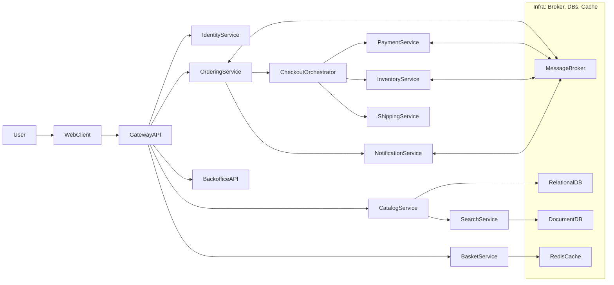

# CommerceHub – Distributed .NET E‑Commerce Platform

## 1. Vision and Goals

- **Primary goal**: Build a realistic, production-style distributed e‑commerce platform in .NET that demonstrates senior-level backend skills: domain modeling, microservices, resilience, observability, security, and DevOps.
- **Non-goals**: Full-featured UI or exhaustive business feature set; the focus is on demonstrating depth of backend design and implementation.

### Core showcase themes

- **Microservices & bounded contexts**: Clear domain boundaries with multiple independently deployable services.
- **Advanced patterns**: DDD, CQRS, Sagas/process managers, Outbox, eventual consistency, idempotency, and resilience patterns (circuit breakers, retries, bulkheads).
- **Cloud-native**: Containers, orchestration (Kubernetes), centralized config and secrets, structured logging, metrics and tracing.
- **Security and multi-tenancy**: OAuth2/OIDC, RBAC, and optional tenant isolation strategy.

---

## 2. High-Level Architecture

### 2.1 Service landscape

Each bullet is a separate .NET microservice (separate repo or folder under a mono-repo) and project named with the solution prefix (e.g., `CommerceHub.CatalogService`):

- **Gateway/API Edge**
  - `CommerceHub.GatewayApi` – BFF/API gateway exposing REST/GraphQL to web and mobile frontends, handling auth, request shaping, and aggregation, and providing Swagger or Scalar UI for endpoint exploration.
- **Identity & Access**
  - `CommerceHub.IdentityService` – ASP.NET Core Identity-backed user management (registration, login, roles, permissions, tenants) and token issuance.
- **Catalog & Search**
  - `CommerceHub.CatalogService` – Products and categories; **EF Core only** on PostgreSQL (no Marten). Create/update/delete and event publishing use **Wolverine outbox** (`IDbContextOutbox<CatalogDbContext>`) so persistence and outbox write occur in the **same transaction**. Publishes versioned catalog events (ProductCreated/Updated/Deleted, CategoryCreated/Updated/Deleted) to RabbitMQ. No product list endpoint; search is only via SearchService.
  - `CommerceHub.SearchService` – Search index and full-text product search. Consumes catalog events from RabbitMQ and projects into MongoDB. **Idempotent projection handlers**: each event carries a `Version` (timestamp); MongoDB documents have a `Version` field; handlers apply an event only if `event.Version >= doc.Version`, so older or duplicate events do not override newer data.
- **Basket & Checkout**
  - `CommerceHub.BasketService` – Customer shopping carts, stored in Redis with Wolverine event publication on changes.
  - `CommerceHub.CheckoutOrchestrator` – Orchestrates checkout via Wolverine Saga: payment, inventory reservation, and order creation.
- **Orders & Payments**
  - `CommerceHub.OrderingService` – Order lifecycle, CQRS and event-sourced via Wolverine + Marten to showcase patterns.
  - `CommerceHub.PaymentService` – Payment gateway abstraction and webhook handling with Wolverine messaging.
- **Inventory & Shipping**
  - `CommerceHub.InventoryService` – Stock levels, reservations, and warehouse allocations, persisted with Marten and projected to MongoDB as needed.
  - `CommerceHub.ShippingService` – Shipping quotes, shipment creation, and tracking integration.
- **Support & Notifications**
  - `CommerceHub.NotificationService` – Email/SMS/push via outbox pattern using Marten.
  - `CommerceHub.SupportService` (optional) – Tickets, returns (RMA), and customer support flows.
- **Backoffice & Admin**
  - `CommerceHub.BackofficeApi` – Admin endpoints for catalog management, promotions, and reports (may share code with BFF but separated auth and capabilities).

### 2.2 System context diagram (high level)

---

## 3. Technology Stack

- **Language & runtime**: .NET 10 (or latest preview/LTS at implementation time), C#.
- **Web stack**: ASP.NET Core minimal APIs or Wolverine HTTP endpoints; optional gRPC for internal synchronous calls where beneficial.
- **Messaging & CQRS/ES**: Wolverine for commands, events, sagas, and messaging across services; Marten on PostgreSQL as the event store and for some projections; shared message contracts in `CommerceHub.Contracts`.
- **ORM & data access**: EF Core as the primary ORM for relational data models on PostgreSQL, especially for non-event-sourced aggregates and transactional write models.
- **Datastores**:
  - Relational & event store: PostgreSQL (EF Core for ORM, Marten for event streams and selected projections).
  - NoSQL: MongoDB for read-optimized projections (catalog, search projections, order history views).
  - Cache: Redis for basket and hot read models.
- **Validation**: FluentValidation for request and command validation, integrated into the pipeline across services.
- **Error handling**: Centralized global error handling middleware producing RFC 7807 ProblemDetails responses consistently across all HTTP APIs.
- **Observability**: OpenTelemetry (traces, metrics, logs) with exporters to Prometheus/Grafana, Jaeger/Tempo, and structured JSON logging (e.g., Serilog).
- **Security**: ASP.NET Core Identity for user store and authentication flows (no external IdP initially), issuing JWT access tokens via the identity API; Key vault / Secrets Manager in cloud.
- **Container & orchestration**: Docker images for each service (Dockerfiles per API project), Kubernetes (Helm or Kustomize) manifests in `deploy/k8s`.
- **CI/CD**: GitHub Actions or Azure DevOps pipelines with build, test, security scanning, and deployment stages.

---

## 4. Bounded Contexts and Data Ownership

Map microservices to bounded contexts using DDD:

- **IdentityContext** (`identity-service`)
  - Aggregates: `User`, `Role`, `Tenant`, `Permission`.
  - Responsibilities: Authentication, token issuance, role/tenant membership.
- **CatalogContext** (`catalog-service`, `search-service`)
  - Aggregates: `Product`, `Category`, `PriceList`, `Promotion`.
  - Responsibilities: Authoritative source of product info and merchandising.
  - **Current implementation**: CatalogService uses **EF Core only** (PostgreSQL); no Marten. Create/update/delete and event publishing use **Wolverine EF outbox** (`IDbContextOutbox<CatalogDbContext>`): `SaveChangesAndFlushMessagesAsync()` commits entity changes and outbox messages in one transaction. Events (ProductCreated/Updated/Deleted, CategoryCreated/Updated/Deleted) include a **Version** (timestamp) and are published to RabbitMQ queue `catalog-events`. SearchService consumes these events and updates MongoDB `product_search`; projection handlers are **idempotent**: they apply an event only when `event.Version >= doc.Version`, so older or duplicate events do not overwrite the database. Product search is exposed only by SearchService (GET /search/products); Catalog has no product list endpoint.
- **BasketContext** (`basket-service`)
  - Aggregates: `Basket`, `BasketItem`.
  - Responsibilities: Ephemeral shopping carts, discount applications.
- **OrderingContext** (`ordering-service`, `checkout-orchestrator`)
  - Aggregates: `Order`, `OrderLine`, `OrderPayment`, `OrderShipment`.
  - Responsibilities: Order lifecycle, including state machine and Sagas.
- **InventoryContext** (`inventory-service`)
  - Aggregates: `SkuStock`, `Reservation`, `Warehouse`.
  - Responsibilities: Stock and reservations consistent with orders.
- **PaymentContext** (`payment-service`)
  - Aggregates: `Payment`, `Refund`.
  - Responsibilities: Interaction with external payment providers.
- **NotificationContext** (`notification-service`)
  - Aggregates: `NotificationTemplate`, `NotificationJob`.
  - Responsibilities: Reliable async user notifications.

Each context has its own schema or database. No shared database across contexts; cross-context interactions use messages or well-defined APIs.

---

## 5. Advanced Patterns to Demonstrate

### 5.1 Domain-Driven Design and Vertical Slice Architecture

- **Vertical slices per feature**: within each service (e.g., `[src/CommerceHub.OrderingService](src/CommerceHub.OrderingService)`), group code by feature rather than by technical layer:
  - `Features/Orders/PlaceOrder` – Wolverine endpoint/handler, command, FluentValidation validator, EF Core/Marten persistence logic, and mapping in a single slice.
  - `Features/Orders/CancelOrder`, `Features/Orders/ShipOrder`, etc., each encapsulating its own handlers, validators, and data access.
- **Shared primitives**: use `Domain` or `Core` folders only for truly shared domain concepts (aggregates, value objects, enums, domain events) reused across multiple slices.
- **Infrastructure integration**: EF Core DbContexts, Marten configuration, and Wolverine configuration live close to each service but are consumed from slices via abstractions or direct usage where appropriate to keep slices cohesive.
- **Patterns**: DDD aggregates and value objects, domain events and handlers, and vertical slice-based request handling instead of a strictly layered clean architecture.

### 5.2 CQRS (Command Query Responsibility Segregation)

- **Target area**: Orders and read models.
- **Commands**: `PlaceOrder`, `CancelOrder`, `PayOrder`, `ShipOrder`, etc. handled by `Ordering.Application`.
- **Queries**: Simplified read models exposed via separate endpoints / read DB for `GetOrderDetails`, `GetOrderHistory`, `GetOrdersForCustomer`.
- **Implementation**: Write model in PostgreSQL, read projections in MongoDB or denormalized PostgreSQL tables.

### 5.3 Event Sourcing (core pattern)

- **Target area**: `OrderingContext` (with `Order` as a fully event-sourced aggregate) and selected supporting aggregates where it adds value.
- **Design**:
  - Append-only event store for `Order` events using Marten on PostgreSQL: `OrderPlaced`, `OrderPaid`, `OrderShipped`, `OrderCancelled`, etc.
  - Snapshotting for performance after N events.
  - Rebuild read models (order detail views, timelines) from event streams into MongoDB or PostgreSQL projections.
- **Showcase**: A `RebuildProjections` admin endpoint to replay events into new projections (e.g., for reporting or changed read model schema). Event sourcing is a mandatory part of the architecture, not an optional add-on.

### 5.4 Sagas / Process Managers

- **Target flow**: Checkout orchestration.
- **Saga steps** (in `checkout-orchestrator`):
  1. Reserve inventory (send command to `inventory-service`).
  2. Initiate payment (command to `payment-service`).
  3. On payment success, create order (`ordering-service`).
  4. On order created, confirm inventory reservation.
  5. On failures, trigger compensating actions (release reservation, void/refund payment, notify user).
- **Implementation**:
  - Use message broker with durable queues.
  - Saga state persisted in its own store (e.g., PostgreSQL) with idempotent message handling and correlation IDs.

### 5.5 Outbox and Inbox Patterns

- **Outbox**: For services that publish integration events (`catalog-service`, `ordering-service`, `payment-service`, `inventory-service`, `notification-service`):
  - Store outgoing events in an outbox (same transaction as domain changes). **CatalogService** uses **Wolverine EF Core outbox**: handlers use `IDbContextOutbox<CatalogDbContext>`; entity changes and `PublishAsync` are committed together via `SaveChangesAndFlushMessagesAsync()`, so create/update/delete and event publish are atomic.
  - Background worker reads from outbox, publishes to broker, and marks processed (idempotent, with retry and poison queue handling).
- **Inbox** (optional): For idempotent consumption, store processed message IDs and guard against duplicates. **SearchService** achieves idempotency via **versioned events and versioned MongoDB documents**: events carry a `Version` (timestamp); projection handlers apply only when `event.Version >= doc.Version`, so replays or out-of-order delivery do not overwrite newer state.

### 5.6 Resilience, Idempotency, and Consistency

- **Resilience**:
  - Use Polly policies (or built-in .NET resilience) for retries, circuit breakers, rate limiting, and timeouts on outbound calls.
  - Bulkhead isolation per service and per external dependency.
- **Idempotency**:
  - Idempotency keys for HTTP commands (e.g., `PlaceOrder`) stored in a dedicated table.
  - Idempotent message handlers via Inbox pattern.
- **Consistency**:
  - Emphasize eventual consistency across services through events and Sagas.
  - Explicit documentation of read-your-writes expectations and how UI handles eventual consistency.

### 5.7 Observability and Operational Excellence

- **Tracing**: Distributed traces across services via OpenTelemetry; context propagation via HTTP headers and message metadata.
- **Metrics**: Service-level metrics (latency, throughput, error rates, queue lag, DB calls) exported to Prometheus.
- **Logging**: Structured logs enriched with correlation IDs, user IDs, tenant IDs.
- **Dashboards**: Example Grafana dashboards definitions in `deploy/observability`.

---

## 6. Security and Tenancy

- **Authentication**:
  - Central `CommerceHub.IdentityService` using ASP.NET Core Identity, exposing APIs for registration, login, and token issuance.
  - PKCE flows for SPA/mobile, client credentials or internal JWTs for service-to-service calls.
- **Authorization**:
  - Role-based (e.g., `Customer`, `Admin`, `SupportAgent`) and policy-based (e.g., `ManageCatalog`, `ViewOrders`).
  - Scope-based permissions for B2B integrations.
- **Multi-tenancy (optional spotlight)**:
  - Tenant in JWT claims; tenant-specific schemas or filters; per-tenant rate limiting.
- **Transport security**:
  - TLS everywhere, secure headers on API gateway, secret management tied into platform key vault.

---

## 7. Data & Messaging Design

### 7.1 Message contracts

- Define shared contracts in `CommerceHub.Contracts` (separate .NET class library distributed as a NuGet package):
  - Events: `OrderPlacedV1`, `OrderPaidV1`, `OrderCancelledV1`, `PaymentAuthorizedV1`, `InventoryReservedV1`, `InventoryReservationFailedV1`, `UserRegisteredV1`, etc.
  - Commands: `ReserveInventory`, `ReleaseInventory`, `InitiatePayment`, `CreateOrder`, etc.
- Use versioning strategy for messages with backward compatibility.

### 7.2 Data modeling highlights

- **Ordering**: Aggregate ensuring invariants (total price consistency, allowed state transitions) with event stream or write model.
- **Inventory**: Reservation model to avoid overselling; concurrency-safe updates with optimistic concurrency.
- **Catalog**: Soft deletes; **no Marten** in CatalogService—EF Core only. Catalog events are versioned (timestamp); SearchService MongoDB documents store `Version` and projection handlers are idempotent (apply only when event version is newer). Read-optimized product search lives in SearchService (MongoDB).

---

## 8. Developer Experience & Repository Structure

### 8.1 Repository layout (mono-repo example)

- **Root**
  - `src/`
    - `CommerceHub.GatewayApi/`
    - `CommerceHub.IdentityService/`
    - `CommerceHub.CatalogService/`
    - `CommerceHub.SearchService/`
    - `CommerceHub.BasketService/`
    - `CommerceHub.OrderingService/`
    - `CommerceHub.CheckoutOrchestrator/`
    - `CommerceHub.InventoryService/`
    - `CommerceHub.PaymentService/`
    - `CommerceHub.ShippingService/`
    - `CommerceHub.NotificationService/`
    - `CommerceHub.BackofficeApi/`
    - `CommerceHub.BuildingBlocks/` (common libraries: `CommerceHub.Contracts`, `CommerceHub.BuildingBlocks` for base classes, Wolverine/Marten configuration, pipeline behaviors, etc.)
  - `tests/`
    - `CommerceHub.GatewayApi.Tests/`
    - `CommerceHub.IdentityService.Tests/`
    - `CommerceHub.CatalogService.Tests/`
    - `CommerceHub.SearchService.Tests/`
    - `CommerceHub.BasketService.Tests/`
    - `CommerceHub.OrderingService.Tests/`
    - `CommerceHub.CheckoutOrchestrator.Tests/`
    - `CommerceHub.InventoryService.Tests/`
    - `CommerceHub.PaymentService.Tests/`
    - `CommerceHub.ShippingService.Tests/`
    - `CommerceHub.NotificationService.Tests/`
    - `CommerceHub.BackofficeApi.Tests/`
    - Each test project may contain `Unit`, `Integration`, and `Contract` subfolders following vertical slices (e.g., `Features/Orders/PlaceOrder` tests mirroring production code slices).
  - `deploy/`
    - `k8s/` manifests or Helm charts.
    - `observability/` dashboards, alert rules.
  - `docs/` – architecture decision records (ADRs), diagrams, onboarding.

### 8.2 Local development and Dockerfiles

- Docker Compose to spin up all dependencies (PostgreSQL for Marten, MongoDB, Redis, broker, identity) and a minimal set of services.
- Developer tooling: hot reload, seed scripts, data reset tools, sample Postman/HTTP collections.
- Dockerfiles placed in each API/service project (e.g., `CommerceHub.CatalogService/Dockerfile`) aligned with the folder structure and referenced by Docker Compose and Kubernetes manifests.

---

## 9. Implementation Roadmap (High-Level)

The todos below are grouped and prioritized for an incremental yet demonstrative build. They correspond to the structured todo list attached to this plan.

1. **Foundation & building blocks**
  - Initialize solution and repositories, create building blocks library, and set up contracts package.
  - Implement standardized error handling, API conventions, and middleware (correlation IDs, logging, exception mapping).
2. **Identity & gateway**
  - Implement `CommerceHub.IdentityService` with ASP.NET Core Identity and JWT issuance.
  - Implement `CommerceHub.GatewayApi` with auth, routing to first backend services, basic rate limiting, global ProblemDetails error handling, and Swagger/Scalar UI.
3. **Catalog & basket**
  - Build `CommerceHub.CatalogService` with vertical slice architecture, Wolverine/Marten, EF Core-backed write models, and CRUD+pricing, projecting to MongoDB.
  - Build `CommerceHub.BasketService` with Redis, FluentValidation, and Wolverine events on checkout start.
4. **Ordering with CQRS and event sourcing**
  - Implement `CommerceHub.OrderingService` with Wolverine/Marten-based write and read models; fully event-sourced order lifecycle and MongoDB projections, alongside EF Core where relational modeling is preferred.
  - Implement projections and queries for order history.
5. **Checkout Saga & integrations**
  - Implement `CommerceHub.CheckoutOrchestrator` Saga coordinating inventory, payment, and ordering with Wolverine.
  - Implement `CommerceHub.InventoryService` and `CommerceHub.PaymentService` with Marten persistence and external provider abstraction.
6. **Notifications & backoffice**
  - Implement `notification-service` using outbox.
  - Implement `backoffice-api` with admin operations.
7. **Observability, resilience, and hardening**
  - Wire OpenTelemetry, logging, metrics, health checks, readiness/liveness probes.
  - Add resilience policies, idempotency, and improve error handling.
8. **Deployment, CI/CD, and documentation**
  - Define Dockerfiles, K8s manifests/Helm, and GitHub Actions pipelines.
  - Write comprehensive documentation and ADRs highlighting architectural decisions and patterns.

---

## 10. Implementation Todo List

All tracked todo items for the CommerceHub plan (also present in frontmatter for tooling):

1. **foundation-setup** – Set up root repository, .NET 10 solution structure, and common building blocks (CommerceHub.BuildingBlocks, CommerceHub.Contracts, shared Wolverine/Marten configuration, EF Core configuration, resilience policies, FluentValidation setup, global ProblemDetails error handling, and logging abstractions). Ensure solution folders mirror file system folders and vertical slice service structure.
2. **identity-and-auth** – Implement CommerceHub.IdentityService with ASP.NET Core Identity as the security backbone, including basic user registration, login, and JWT issuance (no external IdP yet).
3. **gateway-api** – Create CommerceHub.GatewayApi service that fronts all backend APIs, handles authentication/authorization, request shaping, and exposes customer-facing endpoints, with Swagger or Scalar UI for endpoint exploration.
4. **catalog-service** – CommerceHub.CatalogService: vertical slice architecture, **EF Core only** on PostgreSQL (no Marten), **Wolverine outbox** so create/update/delete and event publish share the same transaction, product/category CRUD, FluentValidation, versioned catalog events to RabbitMQ. Search only via SearchService; idempotent search projections using event/document Version. **(Completed.)**
5. **basket-service** – Implement CommerceHub.BasketService using Redis for basket storage, Wolverine for HTTP endpoints and messaging, and events when checkout is initiated.
6. **ordering-service-cqrs** – Implement CommerceHub.OrderingService with Wolverine + Marten-based CQRS and mandatory event sourcing for the Order aggregate, EF Core where relational modeling is preferred, domain events, and order lifecycle orchestration with MongoDB projections.
7. **ordering-event-sourcing** – Implement event sourcing for the Order aggregate using Marten on PostgreSQL, including event store, snapshots, and projection rebuilding endpoints.
8. **inventory-service** – Implement CommerceHub.InventoryService with stock, reservations, and integration with ordering and checkout orchestrator via Wolverine messages, EF Core-backed persistence, and Marten events where helpful.
9. **payment-service** – Implement CommerceHub.PaymentService abstracting external payment providers, including webhook handling and integration events (PaymentAuthorized, PaymentFailed) using Wolverine messaging, EF Core-backed persistence, and Marten events where helpful.
10. **checkout-saga** – Implement CommerceHub.CheckoutOrchestrator as a Saga (process manager) using Wolverine to coordinate inventory reservation, payment, and order creation with compensating actions on failure.
11. **notification-service** – Implement CommerceHub.NotificationService with outbox pattern (via Marten) to send email/SMS/push notifications on key events (OrderPlaced, OrderShipped, etc.).
12. **backoffice-api** – Create CommerceHub.BackofficeApi for admin operations (catalog management, promotions, order management, basic reporting) using Wolverine endpoints and MongoDB projections.
13. **observability-stack** – Integrate OpenTelemetry tracing, metrics, and structured logging across all CommerceHub services and provide sample Grafana/Jaeger dashboards.
14. **resilience-and-idempotency** – Apply resilience patterns (retries, circuit breakers, timeouts, bulkheads) and idempotency mechanisms for commands and Wolverine message handlers.
15. **global-error-handling-and-validation** – Implement global error handling middleware and filters to produce RFC 7807 ProblemDetails responses consistently, and wire FluentValidation into all services to provide standardized validation errors.
16. **data-messaging-design** – Finalize and document message contracts, database schemas per bounded context, and eventual consistency strategies.
17. **local-dev-environment** – Create Docker Compose setup for local development with databases, message broker, identity, and a minimal set of services.
18. **k8s-deployment** – Define Kubernetes manifests or Helm charts for each service and supporting infrastructure, including health probes and autoscaling.
19. **ci-cd-pipelines** – Set up CI/CD pipelines (GitHub Actions or Azure DevOps) for build, test, security scan, and deployment of each service.
20. **documentation-and-adrs** – Write architectural documentation, ADRs, and a portfolio-focused README explaining design decisions and patterns demonstrated.
21. **testing-strategy** – Define and implement a comprehensive testing strategy (unit, integration, contract, and end-to-end) with per-service test projects, standardized tooling, and reproducible test infrastructure.

---

## 11. Testing Strategy

### 11.1 Testing principles

- **Shift-left and automation**: Favor fast, automated tests at the unit and integration level, with a smaller but meaningful set of end-to-end flows.
- **Vertical slice alignment**: Tests should mirror the vertical slice structure; for each feature slice (e.g., `Features/Orders/PlaceOrder`), have corresponding tests in the same relative path in the appropriate `*.Tests` project.
- **Deterministic and isolated**: Tests should be repeatable and isolated, using in-memory or containerized infrastructure (via Testcontainers or Docker Compose) rather than shared long-lived state.

### 11.2 Test types

- **Unit tests**
  - Focus on domain logic (aggregates, value objects), Wolverine handlers, and FluentValidation validators.
  - Use xUnit (or NUnit) plus FluentAssertions for expressive assertions.
- **Integration tests**
  - API-level tests using ASP.NET Core test host or Alba to spin up services and exercise HTTP/Wolverine endpoints.
  - Use real EF Core DbContexts (often with PostgreSQL via Testcontainers) and Marten configuration for realistic persistence behavior.
  - Cover persistence boundaries (EF Core and Marten), global error handling (ProblemDetails), and authentication flows.
- **Contract tests**
  - For HTTP APIs exposed by `CommerceHub.GatewayApi` and internal services, define request/response contracts and verify them via tests that assert on JSON structures and status codes.
  - For messaging (Wolverine), verify that handlers consume and emit the expected messages/events.
- **End-to-end / scenario tests**
  - Implement a small set of happy-path and key failure-path scenarios (e.g., browse catalog, add to basket, checkout, payment failure) orchestrated against a composed environment (Docker Compose or ephemeral Testcontainers network).
  - Validate that Sagas, outbox, and projections behave correctly across service boundaries.

### 11.3 Test tooling and infrastructure

- **Test frameworks and libraries**
  - xUnit (or NUnit) as the test framework.
  - FluentAssertions for assertions.
  - Bogus or similar libraries for generating realistic test data.
  - Alba or ASP.NET Core WebApplicationFactory for API-level integration tests.
- **Infrastructure orchestration**
  - Use Testcontainers (or equivalent) for PostgreSQL, MongoDB, Redis, and the message broker in integration and end-to-end tests.
  - Use Respawn or similar tooling to reset databases between tests to keep them isolated.

### 11.4 Per-service testing structure

- Each service has a corresponding test project under `tests/CommerceHub.<Service>.Tests`:
  - Mirror vertical slice folders (e.g., `Features/Orders/PlaceOrder`) inside the test project for unit and integration tests.
  - Include a `Contracts` area where HTTP and messaging contracts are validated.
  - Provide shared testing utilities in a `CommerceHub.Testing` library (optional) for common setup, fixtures, and Testcontainers configuration.

